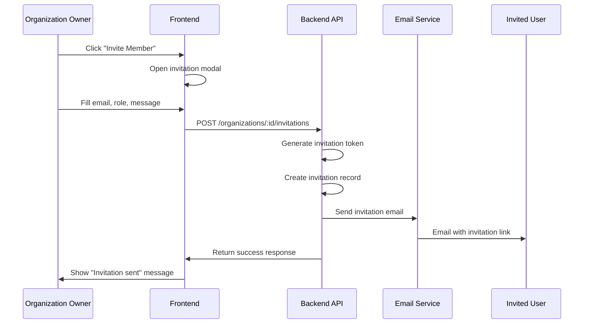
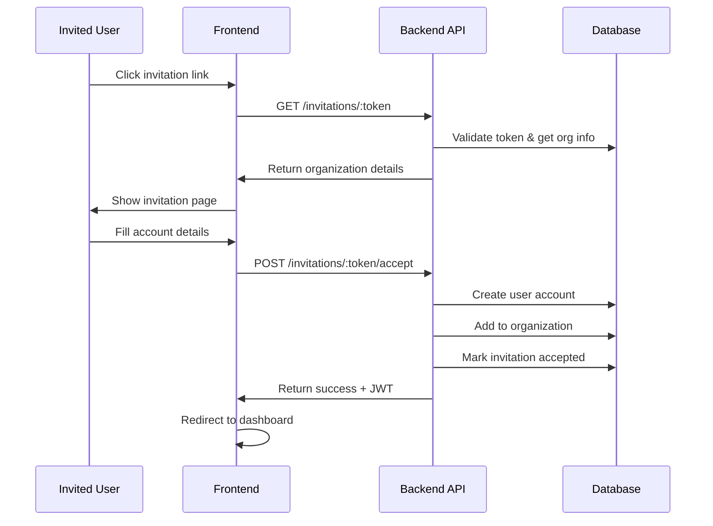

# Organization Invitations & Workspace Management System

## Overview
This document outlines the complete organization invitation system and workspace management for Jynx, enabling users to join multiple organizations and switch between workspaces seamlessly.

## Architecture Overview

```
┌─────────────────┐    ┌─────────────────┐    ┌─────────────────┐
│   Frontend      │    │   Backend API   │    │   Supabase      │
│   (Angular)     │    │   (NestJS)      │    │   (Auth + DB)   │
└─────────────────┘    └─────────────────┘    └─────────────────┘
         │                       │                       │
         │ 1. Send Invitation   │                       │
         ├──────────────────────►│                       │
         │                       │ 2. Create Invite     │
         │                       ├──────────────────────►│
         │                       │ 3. Send Email        │
         │                       │◄──────────────────────┤
         │ 4. Invitation Sent    │                       │
         │◄──────────────────────┤                       │
         │                       │                       │
         │ 5. Accept Invite     │                       │
         ├──────────────────────►│                       │
         │                       │ 6. Verify Token      │
         │                       │ 7. Add to Org         │
         │ 8. Success            │                       │
         │◄──────────────────────┤                       │
```

## Database Schema

### Organization Invitations Table
```sql
CREATE TABLE organization_invitations (
  id UUID PRIMARY KEY DEFAULT gen_random_uuid(),
  organization_id UUID REFERENCES organizations(id) ON DELETE CASCADE,
  invited_by UUID REFERENCES users(id) ON DELETE CASCADE,
  invited_email VARCHAR(255) NOT NULL,
  role VARCHAR(50) DEFAULT 'member' CHECK (role IN ('admin', 'member', 'viewer')),
  token VARCHAR(255) UNIQUE NOT NULL,
  status VARCHAR(50) DEFAULT 'pending' CHECK (status IN ('pending', 'accepted', 'declined', 'expired')),
  expires_at TIMESTAMP WITH TIME ZONE DEFAULT (NOW() + INTERVAL '7 days'),
  accepted_at TIMESTAMP WITH TIME ZONE,
  created_at TIMESTAMP WITH TIME ZONE DEFAULT NOW(),
  updated_at TIMESTAMP WITH TIME ZONE DEFAULT NOW()
);

-- Indexes for performance
CREATE INDEX idx_org_invitations_email ON organization_invitations(invited_email);
CREATE INDEX idx_org_invitations_token ON organization_invitations(token);
CREATE INDEX idx_org_invitations_org_id ON organization_invitations(organization_id);
CREATE INDEX idx_org_invitations_status ON organization_invitations(status);
```

### Updated Organization Members Table
```sql
-- Add invitation tracking
ALTER TABLE organization_members 
ADD COLUMN invited_by UUID REFERENCES users(id),
ADD COLUMN invitation_id UUID REFERENCES organization_invitations(id),
ADD COLUMN joined_via VARCHAR(50) DEFAULT 'direct' CHECK (joined_via IN ('direct', 'invitation', 'owner'));
```

## API Endpoints

### Invitation Management
```
POST   /api/v1/organizations/:id/invitations
GET    /api/v1/organizations/:id/invitations
GET    /api/v1/organizations/:id/invitations/:invitationId
PUT    /api/v1/organizations/:id/invitations/:invitationId
DELETE /api/v1/organizations/:id/invitations/:invitationId
```

### Invitation Acceptance
```
GET    /api/v1/invitations/:token
POST   /api/v1/invitations/:token/accept
POST   /api/v1/invitations/:token/decline
```

### Workspace Management
```
GET    /api/v1/users/workspaces
POST   /api/v1/users/workspaces/switch
GET    /api/v1/organizations/:id/members
```

## Data Transfer Objects (DTOs)

### Invitation DTOs
```typescript
export interface CreateInvitationDto {
  email: string;
  role: 'admin' | 'member' | 'viewer';
  message?: string;
}

export interface InvitationDto {
  id: string;
  organizationId: string;
  invitedBy: string;
  invitedEmail: string;
  role: string;
  status: 'pending' | 'accepted' | 'declined' | 'expired';
  expiresAt: Date;
  createdAt: Date;
  organization: {
    id: string;
    name: string;
    description?: string;
  };
  inviter: {
    id: string;
    firstName: string;
    lastName: string;
    email: string;
  };
}

export interface AcceptInvitationDto {
  token: string;
  firstName: string;
  lastName: string;
  password: string;
}

export interface WorkspaceDto {
  id: string;
  name: string;
  description?: string;
  role: string;
  memberCount: number;
  isCurrent: boolean;
  joinedAt: Date;
}
```

## User Interface Screens

### 1. Organization Dashboard
**Route**: `/dashboard/organizations`

**Features**:
- List of all user's organizations
- Current workspace indicator
- Quick switch between workspaces
- Invite new members button
- Organization settings access

**UI Components**:
```
┌─────────────────────────────────────────────────────────────┐
│ 🏢 Organizations & Workspaces                              │
├─────────────────────────────────────────────────────────────┤
│                                                             │
│ ┌─────────────────┐  ┌─────────────────┐  ┌───────────────┐ │
│ │ 🏢 Acme Corp    │  │ 🏢 TechStart   │  │ 🏢 My Startup │ │
│ │ 👥 12 members   │  │ 👥 5 members    │  │ 👥 3 members  │ │
│ │ 👤 Admin        │  │ 👤 Owner        │  │ 👤 Owner      │ │
│ │ ✅ Current      │  │ 🔄 Switch       │  │ 🔄 Switch     │ │
│ └─────────────────┘  └─────────────────┘  └───────────────┘ │
│                                                             │
│ [+ Invite to Organization]                                 │
│                                                             │
└─────────────────────────────────────────────────────────────┘
```

### 2. Invite Members Modal
**Trigger**: "Invite to Organization" button

**Features**:
- Email input with validation
- Role selection (Admin, Member, Viewer)
- Custom invitation message
- Send invitation button
- Recent invitations list

**UI Components**:
```
┌─────────────────────────────────────────────────────────────┐
│ ✉️ Invite Team Members                                     │
├─────────────────────────────────────────────────────────────┤
│                                                             │
│ Email Address:                                              │
│ [user@example.com                                    ]     │
│                                                             │
│ Role:                                                       │
│ ○ Admin    ○ Member    ○ Viewer                            │
│                                                             │
│ Personal Message (Optional):                                │
│ [Welcome to our team! We're excited to have you...]        │
│                                                             │
│ [Send Invitation] [Cancel]                                 │
│                                                             │
│ Recent Invitations:                                         │
│ • john@example.com (Member) - Pending                      │
│ • sarah@example.com (Admin) - Accepted                     │
│                                                             │
└─────────────────────────────────────────────────────────────┘
```

### 3. Invitation Acceptance Page
**Route**: `/auth/invite/:token`

**Features**:
- Organization information display
- Inviter details
- Account creation form
- Accept/Decline buttons

**UI Components**:
```
┌─────────────────────────────────────────────────────────────┐
│ 🎉 You're Invited!                                         │
├─────────────────────────────────────────────────────────────┤
│                                                             │
│ John Smith has invited you to join:                         │
│                                                             │
│ ┌─────────────────────────────────────────────────────────┐ │
│ │ 🏢 Acme Corporation                                     │ │
│ │ Building amazing products together                      │ │
│ │ 👥 12 team members                                       │ │
│ │ 👤 Your role: Member                                     │ │
│ └─────────────────────────────────────────────────────────┘ │
│                                                             │
│ Create your account:                                        │
│                                                             │
│ First Name: [John                                    ]     │
│ Last Name:  [Doe                                     ]     │
│ Password:    [••••••••••••••••••••••••••••••••••••••]     │
│ Confirm:     [••••••••••••••••••••••••••••••••••••••]     │
│                                                             │
│ [Accept Invitation] [Decline]                              │
│                                                             │
└─────────────────────────────────────────────────────────────┘
```

### 4. Workspace Switcher Component
**Location**: Header/Navigation

**Features**:
- Current workspace display
- Dropdown with all workspaces
- Quick switch functionality
- Workspace creation (for owners)

**UI Components**:
```
┌─────────────────────────────────────────────────────────────┐
│ Header                                                       │
├─────────────────────────────────────────────────────────────┤
│                                                             │
│ 🏢 Acme Corp ▼                    👤 John Doe ▼            │
│   └─ Switch Workspace              └─ Profile               │
│      • TechStart (Owner)              └─ Settings           │
│      • My Startup (Admin)             └─ Logout            │
│      • [+ Create New]                                       │
│                                                             │
└─────────────────────────────────────────────────────────────┘
```

## User Flows

### 1. Invitation Flow


### 2. Acceptance Flow


### 3. Workspace Switching Flow


## Security Considerations

### 1. Invitation Token Security
- **Token Generation**: Use cryptographically secure random tokens
- **Expiration**: 7-day expiration for invitations
- **Single Use**: Tokens become invalid after acceptance
- **Rate Limiting**: Limit invitation sending per organization

### 2. Permission Validation
- **Invitation Rights**: Only admins/owners can invite
- **Role Assignment**: Users can't assign roles higher than their own
- **Organization Access**: Validate user belongs to organization

### 3. Email Security
- **Domain Validation**: Optional domain whitelist
- **Email Verification**: Require email confirmation
- **Spam Prevention**: Rate limiting and validation

## Implementation Phases

### Phase 1: Database & API Foundation
- [ ] Create invitation tables
- [ ] Implement invitation CRUD endpoints
- [ ] Add invitation acceptance endpoints
- [ ] Create workspace management endpoints

### Phase 2: Backend Services
- [ ] Invitation service with email sending
- [ ] Token generation and validation
- [ ] Permission checking middleware
- [ ] Workspace switching logic

### Phase 3: Frontend Components
- [ ] Organization dashboard
- [ ] Invitation modal
- [ ] Invitation acceptance page
- [ ] Workspace switcher component

### Phase 4: Integration & Testing
- [ ] Email template design
- [ ] End-to-end testing
- [ ] Error handling
- [ ] Performance optimization

## Email Templates

### Invitation Email
```html
<!DOCTYPE html>
<html>
<head>
    <title>You're Invited to Join {{organizationName}}</title>
</head>
<body>
    <div style="max-width: 600px; margin: 0 auto; font-family: Arial, sans-serif;">
        <h1>🎉 You're Invited!</h1>
        
        <p>Hi there!</p>
        
        <p><strong>{{inviterName}}</strong> has invited you to join <strong>{{organizationName}}</strong> as a <strong>{{role}}</strong>.</p>
        
        <div style="background: #f8f9fa; padding: 20px; border-radius: 8px; margin: 20px 0;">
            <h3>🏢 {{organizationName}}</h3>
            <p>{{organizationDescription}}</p>
            <p><strong>Your Role:</strong> {{role}}</p>
        </div>
        
        <p>{{personalMessage}}</p>
        
        <div style="text-align: center; margin: 30px 0;">
            <a href="{{invitationLink}}" 
               style="background: #3b82f6; color: white; padding: 12px 24px; text-decoration: none; border-radius: 6px; display: inline-block;">
                Accept Invitation
            </a>
        </div>
        
        <p style="color: #666; font-size: 14px;">
            This invitation expires in 7 days. If you don't want to join, you can simply ignore this email.
        </p>
    </div>
</body>
</html>
```

## Success Metrics

### Technical Metrics
- [ ] < 200ms invitation creation time
- [ ] 99.9% email delivery rate
- [ ] < 1% invitation token conflicts
- [ ] 100% secure token generation

### User Experience Metrics
- [ ] < 3 clicks to send invitation
- [ ] < 30 seconds to accept invitation
- [ ] < 2 seconds workspace switching
- [ ] Clear error messages for all failure cases

### Business Metrics
- [ ] Increased organization growth
- [ ] Higher user engagement
- [ ] Reduced support tickets
- [ ] Improved team collaboration

## Future Enhancements

### Planned Features
- **Bulk Invitations**: Invite multiple users at once
- **Invitation Templates**: Pre-defined invitation messages
- **Domain Restrictions**: Limit invitations to specific domains
- **Guest Access**: Temporary access for external collaborators
- **Organization Hierarchies**: Parent-child organization relationships

### Advanced Features
- **SSO Integration**: Single sign-on for enterprise
- **Custom Roles**: User-defined permission sets
- **Audit Logging**: Track all invitation activities
- **Analytics Dashboard**: Organization growth metrics
- **API Access**: Programmatic invitation management
